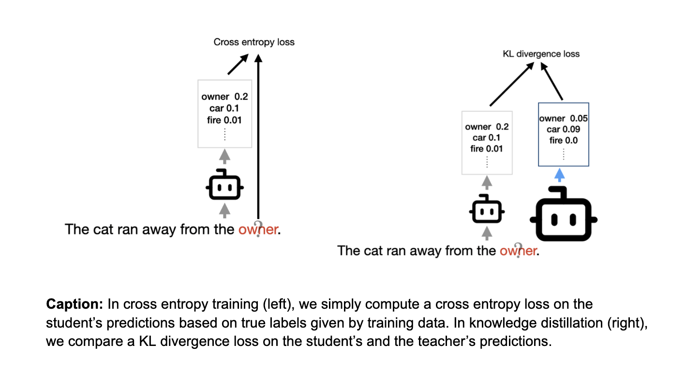
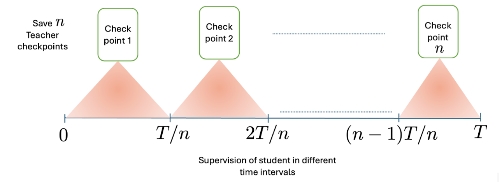
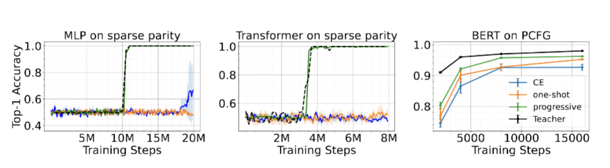
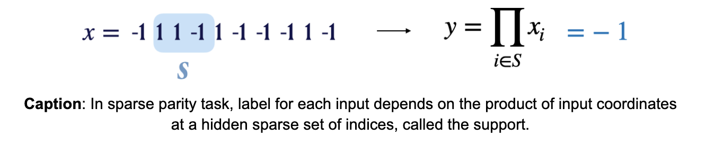
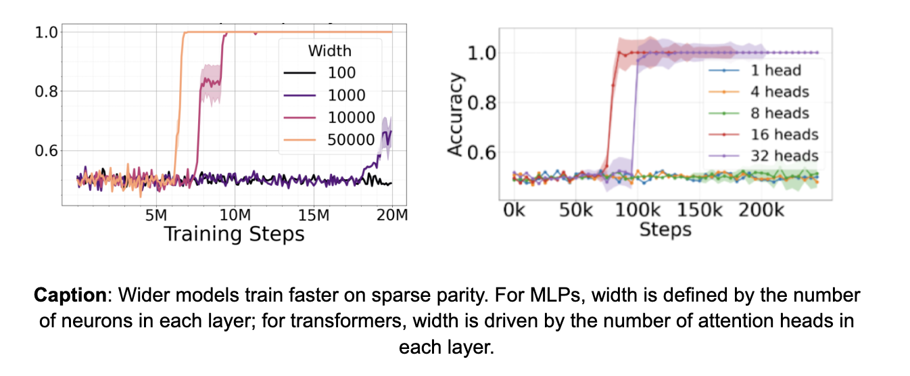
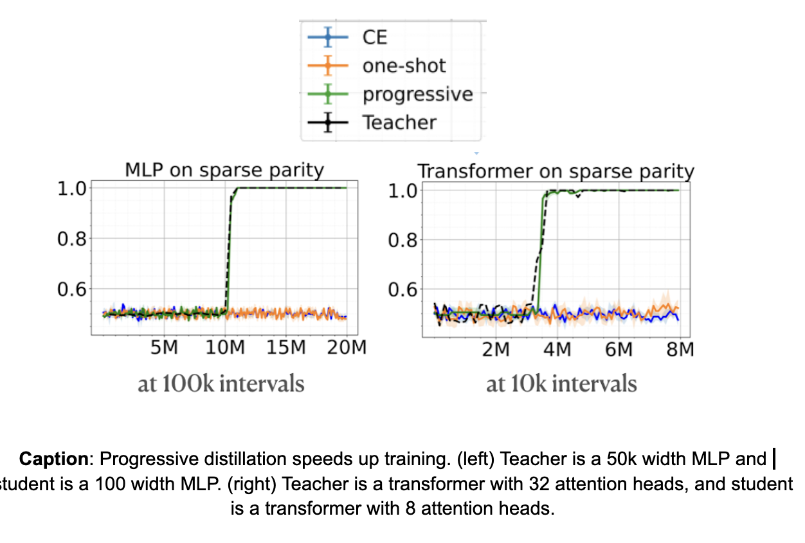
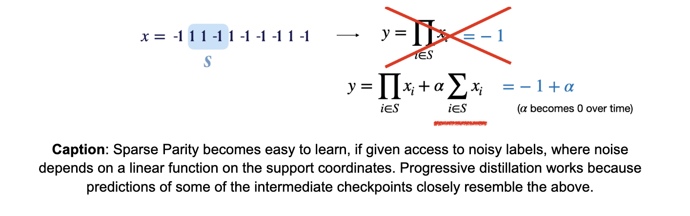
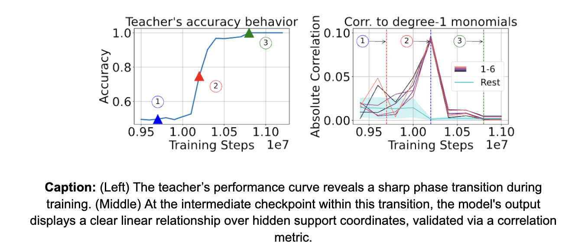
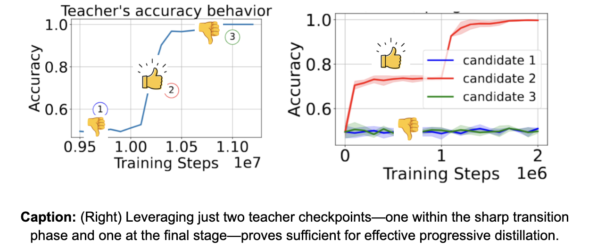

---

  

  

layout: post

  

  

title: "How Progressive Distillation Unlocks Faster training in AI Models"

  

  

author: "Abhishek Panigrahi, Bingbin Liu, Sadhika Malladi, Andrej Risteski, Surbhi Goel"

  

  

categories: journal

  

  

tags: [documentation,sample]

  

  

image: phase.png

  

  

excerpt: "By [Abhishek Panigrahi](https://abhishekpanigrahi1996.github.io/), [Bingbin Liu](https://clarabing.github.io), [Sadhika Malladi](https://www.cs.princeton.edu/~smalladi/), [Andrej Risteski](https://www.andrew.cmu.edu/user/aristesk/) and [Surbhi Goel](https://www.surbhigoel.com/).

  

  

**TL; DR** Progressive distillation, where the student model distills from several intermediate teachers, is shown to outperform distilling directly from the strongest teacher. Our work provides an explanation to progressive distillation’s effectiveness, from an optimization perspective. Intuitively, the intermediate teacher checkpoints provide an “implicit curriculum” of easier-to-learn subtasks, which eases the student’s optimization. We formalize this idea into provable optimization benefits on learning sparse parity, and provide empirical evidence on broader tasks. Paper will be presented as an Oral in ICLR 2025 (to be held in Singapore).

---

<!--  -->

  

  

  

  

By [Abhishek Panigrahi](https://abhishekpanigrahi1996.github.io/), [Bingbin Liu](https://clarabing.github.io), [Sadhika Malladi](https://www.cs.princeton.edu/~smalladi/), [Andrej Risteski](https://www.andrew.cmu.edu/user/aristesk/) and [Surbhi Goel](https://www.surbhigoel.com/)

  

  

  

*This post is based on [“Progressive distillation induces an implicit curriculum”](https://arxiv.org/abs/2410.05464) by Abhishek Panigrahi, Bingbin Liu, Sadhika Malladi, Andrej Risteski, and Surbhi Goel*

  

  

  

## Knowledge Distillation and the capacity gap

  

  

  
Knowledge distillation has been a cornerstone technique in training AI models ([Hinton 2015](https://arxiv.org/abs/1503.02531)). The idea is simple: train a smaller model (student) using the output of a larger, more capable model (teacher). A common variant is to distill from the predictions, where the loss function is defined by a KL divergence loss between the predictions of the student and a teacher model. This form of distillation can be viewed as a variant of standard cross entropy training, where we change the label distribution from a point mass to the distribution defined by the teacher’s output.
  

  

------

  

—----
**Cross Entropy from training data:** On input and label pairs, we simply compute cross entropy loss of the model’s prediction with the true label.

**Knowledge Distillation:** We compare the student’s model output with a teacher’s model output using a KL divergence loss.
  

{: width="30%" .center-image }

------

It might feel natural to think that the better the teacher, the better the distilled student. However, a persistent challenge in practice is that a better teacher (a better performing model) does not always yield a better student Prior work has attributed this to a “capacity gap” ([Mirzadeh et al. 2019](https://arxiv.org/abs/1902.03393),where the student fails to learn from the teacher when the gap is too large, a challenge that is also recently observed in language models [Busbridge et al.’24](https://arxiv.org/abs/2502.08606)). 

## Faster training with progressive distillation

A common mitigation is to let the student progressively distill from increasingly more performant teachers, which was recently used to train [Gemini Flash](https://arxiv.org/abs/2403.05530). In our work, we consider a particular form of progressive distillation which trains the student using outputs from intermediate checkpoints of the teacher. Figure 1 shows an example where the intermediate checkpoints are chosen at regular intervals.

{: width="30%" .center-image }

  

We show that progressive distillation significantly accelerates the training of smaller models across multiple settings. Our experiments span three data setups:

**Sparse parity** – a well-studied synthetic task for neural network optimization,

**PCFGs** – a generative framework capturing hierarchical relationships in languages, and

**Real-world datasets** – including Wikipedia and Books.

In all cases, progressive distillation enables a student model (MLP or Transformer) to learn efficiently from its teacher, whereas one-shot distillation and cross-entropy training lead to slow learning or failure.

  
{: width="30%" .center-image }

This aligns with the observations of an extensive line of work on progressive distillation. For example, [Mirzadeh et al.,2019](https://arxiv.org/abs/1902.03393); [Jin et al.,2019](https://openaccess.thecvf.com/content_ICCV_2019/html/Jin_Knowledge_Distillation_via_Route_Constrained_Optimization_ICCV_2019_paper.html); [Jafari et al., 2021](https://arxiv.org/abs/2104.07163); [Harutyunyan et al., 2022](https://arxiv.org/abs/2301.12245) show performance improvements on vision tasks. One common reasoning behind the success of progressive distillation is that it reduces the``capacity gap’’ between the teacher and the student, which helps a student generalize better. Instead, we show an optimization benefit of progressive distillation, where the student learns faster due to an easy-to-learn curriculum supervision from the intermediate checkpoints.

## Underlying mechanism: Implicit Curriculum in feature learning provides easier-to-learn signals

Here, we will extensively study the behavior of progressive distillation on sparse parity. We show that the student can train as fast as the teacher itself by following the training trajectory of the teacher. We primarily consider the two following questions:

**Q1:** How do the intermediate checkpoints help during progressive distillation?

**Q2:** Are all teacher checkpoints needed for supervision during progressive distillation?

  
  

## Sparse Parity

Sparse parity is a well studied synthetic task that has been regularly used to understand how neural networks learn the right features for solving a task ([Barak et al’22](https://proceedings.neurips.cc/paper_files/paper/2022/hash/884baf65392170763b27c914087bde01-Abstract-Conference.html), [Edelman et al.’23](https://arxiv.org/abs/2309.03800)). In this task, the input is a boolean sequence containing +1 and -1, and the output is a **product of the input coordinates at a hidden sparse set of indices**, called the **support**. 
  
{: width="30%" .center-image }

The task of sparse parity has been known to be a computationally difficult problem ([kearns et al.'98](https://dl.acm.org/doi/10.1145/293347.293351)). This is because to solve the problem, the learning algorithm needs to search for the hidden support of indices from input and label pairs. Because there are exponentially many candidates, [Edelman’23](https://arxiv.org/abs/2309.03800) shows that learning sparse parity with a gradient based algorithm requires the **total amount of compute** to grow **exponentially with the size of the hidden support**. The total amount of compute is measured by a product of the size of the training model and the total time required to train. Informally, this suggests that a larger model will learn faster than a smaller model.

When we train an MLP (or a transformer) on this task, we observe a **sharp phase transition** in performance where the model rapidly transitions from random guessing to near-perfect accuracy. As suggested by our discussion above, we observe that **wider MLPs** (or **transformers with more attention heads**) learn faster than smaller (narrower) models. Intuitively, the dormant phase before this transition indicates a search phase for the model, where the model’s neurons search for the support. A larger model can search faster, because of its higher capacity in terms of the number of neurons that it can use to conduct the search.

{: width="30%" .center-image }

Now, we compare different distillation strategies to train a smaller model faster, using the checkpoints of a larger model that trained successfully. We observe that **progressive distillation enables the student to learn at the same speed as the teacher!** However, one-shot distillation, where we use output of the final perfect teacher checkpoint, fails to train the student. This is expected as the final teacher checkpoint which has perfectly learned the task won’t provide any additional information compared to the true labels themselves.

{: width="30%" .center-image }

**Q1: How do the intermediate checkpoints help during progressive distillation?**

Before delving into details on progressive distillation, let's break down the difficulty in learning sparse parity. As discussed before, sparse parity is known to be a difficult task, because of the difficulty in searching for the right set of indices, that form the **support**, from input-label pairs. However, the task **becomes easy if we had access to linear functions on the support coordinates.** Say, we had access to  **noisy labels**, where the noise depends on a linear function on the support coordinates, with the noise removed slowly over time. One can then show that with access to such noisy labels, the sparse parity task can be  **easily learned in polynomial** time.

  
{: width="30%" .center-image }

The secret of progressive distillation is that the predictions of certain intermediate checkpoints **closely resemble** the noisy labels. More formally, the intermediate checkpoint that falls within the sharp phase transition of the teacher **leaks the information on the support** to the student, **via  easier-to-learn functions**. These are also responsible for **the errors or mistakes that its output makes.** Thus, a student learns better when learning from the teacher's mistakes during the course of training, which forms an easy-to-learn curriculum.

{: width="30%" .center-image }

**Q2: Are all teacher checkpoints needed for supervision during progressive distillation?**

No! In fact, we show that instead of storing all intermediate checkpoints of the teacher, only **two teacher checkpoints** are needed for successful and efficient progressive distillation. The first teacher checkpoint should **fall during the phase transition** of the teacher, while the second checkpoint can be set to be the final teacher checkpoint. This supports our claim that progressive distillation is successful because of helpful noise present in the predictions of the teacher checkpoint during its phase transition.

{: width="30%" .center-image }

## Beyond Sparse Parity

The benefit of an implicit curriculum extends beyond sparse parity. In the following, we look at training Transformers on real-world datasets, where the implicit curriculum takes the form of n-grams. We show that the model provides n-gram signals for an increasing n, suggesting that the model gradually learns longer dependencies through training. 

 Specifically, we show the following 3 observations on BERT- style masked prediction on wikipedia and books dataset.

- We observe a 3-phase training in models, where the **second phase marks a phase transition** that shows a sharp drop in training loss.

- Motivated by observations on PCFG, we  measure the change in behavior of the models across the phases through the dependence of their predictions on **n-gram** neighboring context. We observe (see middle figure below) inflection points in the model's dependence on **3-gram** neighboring context during the second phase, after which the model transitions to using longer **n-gram** context for predictions. We call this an **n-gram curriculum**.

## More details on the n-gram curriculum on PCFGs

Here, we dive a little deeper into our experiments on the n-gram curriculum. We use PCFGs as our synthetic testbed and discuss in the setting of BERT training. PCFGs represent a simplistic synthetic setup primarily designed to capture hierarchical relationships between words in a sentence.  BERT models are trained with masked language modeling, where they are trained to predict masked words in a given sentence. For example, given an input 'The [mask] ran away', the model is expected to infer plausible completions for [mask], such as 'cat'. We refer interested readers to appendix D.1 and D.5.1 for more details in our paper.

One important concept in natural language processing is **n-grams**, which is defined as co-occurring ``n’’ words in natural language. For example, ``The cat’’ and ``ran away’’ are examples of 2-grams.

To optimally perform a masked prediction task on PCFGs, a model must leverage all possible dependencies that the masked word can form with other words under the PCFG-defined structure. In the above example, the model should use the likelihood of different words that can form a 4-gram with “The __ ran away”.  However, because of the hierarchical nature, one would expect the model to learn to use shorter n-grams first, and transition slowly to using longer n-grams, which we confirm empirically.

**The probe - Perturbing n-grams:** A model that has learned to connect long-range dependencies among words via capturing higher ``n’’-gram structure can be robust to removing words in the shorter ``n’’-gram context surrounding the [mask] position.

We measure the robustness of the model’s output to removal of '`n’’-gram tokens through a measure called M_{robust}. Specifically, we quantify the change in the model’s predictions via total variation distance, measured before and after removing n-gram tokens for varying values of n. We find that the middle phase—corresponding to the sharp phase transition in the model's loss—marks an inflection point in the model’s robustness behavior. Prior to this inflection, the model’s output is highly sensitive to the removal of 3-gram tokens, indicating a reliance on local dependencies. After the inflection point, robustness against lower n-gram removal sharply decreases, suggesting that the model begins leveraging longer-range contextual information rather than short-range dependencies.

Thus, the curriculum is defined in terms of the prediction dependencies on neighboring n-gram context words. We refer to the transition from short to long n-gram dependencies as the implicit n-gram curriculum, and connect the success of progressive distillation to such curriculum.

**Progressive distillation can be effectively performed with just 2 checkpoints:** To further support the idea that the underlying curriculum drives the success of progressive distillation, we revisit our experiments where we try to utilize only two checkpoints. In particular, we show that successful progressive distillation can be achieved by utilizing just two teacher checkpoints: one corresponding to the inflection point, and another corresponding to the final trained teacher. This finding is consistent with our observations on sparse parity tasks. 

## Interesting future directions

